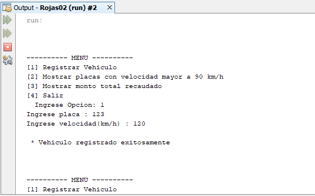

# Multas vehículares
Sistema de multas vehiculares donde registras vehículos con cierta velocidad y les coloca una multa, muestras placas de vehículos con velocidad mayor a 90 km/h y muestra el monto total recaudado con las multas, **15/11/19**.

<strong>Imagen:</strong> Menú principal - Registrar vehículo.

